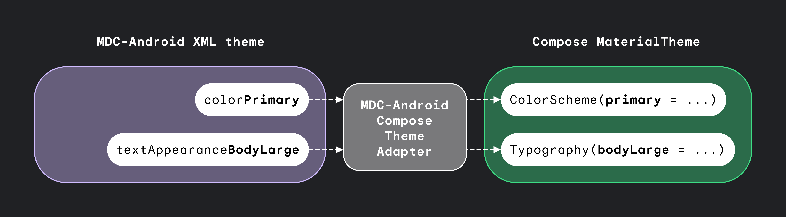

# MDC-Android Compose Theme Adapter

A library that enables reuse of [Material Components for Android][mdc] XML themes for theming in [Jetpack Compose][compose].

## Compose Material


The basis of Material Design 2 theming in [Jetpack Compose][compose] is the [`MaterialTheme`][materialtheme] composable, where you provide [`Colors`][colors], [`Shapes`][shapes] and [`Typography`][typography] instances containing your styling parameters:

``` kotlin
MaterialTheme(
    colors = colors,
    typography = type,
    shapes = shapes
) {
    // M2 Surface, Scaffold, etc.
}
```

[Material Components for Android][mdc] themes allow for similar theming for views via XML theme attributes, like so:

``` xml
<style name="Theme.MyApp" parent="Theme.MaterialComponents.DayNight">
    <!-- Material 2 color attributes -->
    <item name="colorPrimary">@color/purple_500</item>
    <item name="colorSecondary">@color/green_200</item>

    <!-- Material 2 type attributes-->
    <item name="textAppearanceBody1">@style/TextAppearance.MyApp.Body1</item>
    <item name="textAppearanceBody2">@style/TextAppearance.MyApp.Body2</item>

    <!-- Material 2 shape attributes-->
    <item name="shapeAppearanceSmallComponent">@style/ShapeAppearance.MyApp.SmallComponent</item>
</style>
```

This library attempts to bridge the gap between [Material Components for Android][mdc] M2 XML themes, and themes in [Jetpack Compose][compose], allowing your composable [`MaterialTheme`][materialtheme] to be based on the `Activity`'s XML theme:


``` kotlin
MdcTheme {
    // MaterialTheme.colors, MaterialTheme.shapes, MaterialTheme.typography
    // will now contain copies of the Context's theme
}
```

This is especially handy when you're migrating an existing app, a `Fragment` (or other UI container) at a time.

!!! caution
    If you are using an AppCompat (i.e. non-MDC) theme in your app, you should use the
    [AppCompat Compose Theme Adapter](https://github.com/google/accompanist/tree/main/appcompat-theme)
    instead, as it attempts to bridge the gap between [AppCompat][appcompat] XML themes, and M2 themes in [Jetpack Compose][compose].

### Customizing the M2 theme

The `MdcTheme()` function will automatically read the host `Context`'s MDC theme and pass them to [`MaterialTheme`][materialtheme] on your behalf, but if you want to customize the generated values, you can do so via the `createMdcTheme()` function:

``` kotlin
val context = LocalContext.current
val layoutDirection = LocalLayoutDirection.current
var (colors, typography, shapes) = createMdcTheme(
    context = context,
    layoutDirection = layoutDirection
)

// Modify colors, typography or shapes as required.
// Then pass them through to MaterialTheme...

MaterialTheme(
    colors = colors,
    typography = type,
    shapes = shapes
) {
    // Rest of M2 layout
}
```

### Limitations

There are some known limitations with the implementation at the moment:

* This relies on your `Activity`/`Context` theme extending one of the `Theme.MaterialComponents` themes.
* Text colors are not read from the text appearances by default. You can enable it via the `setTextColors` function parameter.
* Variable fonts are not supported in Compose yet, meaning that the value of `android:fontVariationSettings` are currently ignored.
* MDC `ShapeAppearances` allow setting of different corner families (cut, rounded) on each corner, whereas Compose's [Shapes][shapes] allows only a single corner family for the entire shape. Therefore only the `app:cornerFamily` attribute is read, others (`app:cornerFamilyTopLeft`, etc) are ignored.
* You can modify the resulting `MaterialTheme` in Compose as required, but this _only_ works in Compose. Any changes you make will not be reflected in the `Activity` theme.

## Compose Material 3



The basis of Material Design 3 theming in [Jetpack Compose][compose] is the [`MaterialTheme`][m3materialtheme] composable, where you provide [`ColorScheme`][m3colorscheme] and [`Typography`][m3typography] instances containing your styling parameters:

``` kotlin
MaterialTheme(
    colorScheme = colorScheme,
    typography = typography
) {
    // M3 Surface, Scaffold, etc.
}
```

[Material Components for Android][mdc] themes allow for similar theming for views via XML theme attributes, like so:

``` xml
<style name="Theme.MyApp" parent="Theme.Material3.DayNight">
    <!-- Material 3 color attributes -->
    <item name="colorPrimary">@color/purple_500</item>
    <item name="colorSecondary">@color/purple_700</item>
    <item name="colorTertiary">@color/green_200</item>

    <!-- Material 3 type attributes-->
    <item name="textAppearanceBodyLarge">@style/TextAppearance.MyApp.BodyLarge</item>
    <item name="textAppearanceBodyMedium">@style/TextAppearance.MyApp.BodyMedium</item>
</style>
```

This library attempts to bridge the gap between [Material Components for Android][mdc] M3 XML themes, and themes in [Jetpack Compose][compose], allowing your composable [`MaterialTheme`][m3materialtheme] to be based on the `Activity`'s XML theme:


``` kotlin
Mdc3Theme {
    // MaterialTheme.colorScheme, MaterialTheme.typography
    // will now contain copies of the Context's theme
}
```

This is especially handy when you're migrating an existing app, a `Fragment` (or other UI container) at a time.

### Customizing the M3 theme

The `Mdc3Theme()` function will automatically read the host `Context`'s MDC theme and pass them to [`MaterialTheme`][m3materialtheme] on your behalf, but if you want to customize the generated values, you can do so via the `createMdc3Theme()` function:

``` kotlin
val context = LocalContext.current
var (colorScheme, typography) = createMdc3Theme(
    context = context
)

// Modify colorScheme or typography as required.
// Then pass them through to MaterialTheme...

MaterialTheme(
    colorScheme = colorScheme,
    typography = typography
) {
    // Rest of M3 layout
}
```

### Limitations

There are some known limitations with the implementation at the moment:

* This relies on your `Activity`/`Context` theme extending one of the `Theme.Material3` themes.
* Text colors are not read from the text appearances by default. You can enable it via the `setTextColors` function parameter.
* Variable fonts are not supported in Compose yet, meaning that the value of `android:fontVariationSettings` are currently ignored.
* You can modify the resulting `MaterialTheme` in Compose as required, but this _only_ works in Compose. Any changes you make will not be reflected in the `Activity` theme.

---

## Usage

```groovy
repositories {
    google()
}

dependencies {
    // Artifact with MdcTheme, compatible with Compose Material
    implementation "com.google.android.material:compose-theme-adapter:<version>"
    // Artifact with Mdc3Theme, compatible with Compose Material 3
    implementation "com.google.android.material:compose-theme-adapter-3:<version>"
}
```

The latest release is: 

### Library Snapshots

Snapshots of the current development version of this library are available, which track the latest commit. See [here](./docs/using-snapshot-version.md) for more information on how to use them.

---

## Contributions

Please contribute! We will gladly review any pull requests.
Make sure to read the [Contributing](CONTRIBUTING.md) page first though.

## License

```
Copyright 2020 The Android Open Source Project

Licensed under the Apache License, Version 2.0 (the "License");
you may not use this file except in compliance with the License.
You may obtain a copy of the License at

    https://www.apache.org/licenses/LICENSE-2.0

Unless required by applicable law or agreed to in writing, software
distributed under the License is distributed on an "AS IS" BASIS,
WITHOUT WARRANTIES OR CONDITIONS OF ANY KIND, either express or implied.
See the License for the specific language governing permissions and
limitations under the License.
```

 [compose]: https://developer.android.com/jetpack/compose
 [mdc]: https://github.com/material-components/material-components-android
 [appcompat]: https://developer.android.com/jetpack/androidx/releases/appcompat
 [materialtheme]: https://developer.android.com/reference/kotlin/androidx/compose/material/MaterialTheme
 [colors]: https://developer.android.com/reference/kotlin/androidx/compose/material/Colors
 [typography]: https://developer.android.com/reference/kotlin/androidx/compose/material/Typography
 [shapes]: https://developer.android.com/reference/kotlin/androidx/compose/material/Shapes
 [m3materialtheme]: https://developer.android.com/reference/kotlin/androidx/compose/material3/MaterialTheme
 [m3colorscheme]: https://developer.android.com/reference/kotlin/androidx/compose/material3/ColorScheme
 [m3typography]: https://developer.android.com/reference/kotlin/androidx/compose/material3/Typography
